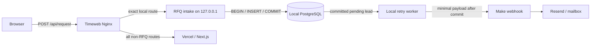

# RFQ RU-first intake v1

Status: target design prepared; not deployed. Base: `1058a28d1fe18802f35ea99f09e74f6cd0d84014`.

## Target flow

`POST /api/request` never enters the generic Vercel proxy location after the
Nginx switch. The retained Next.js route is a rollback implementation, not the
target Production path. The local service resolves Product context from the
validated published-catalog snapshot; it does not call Vercel or Supabase with
contact data.

## First-write and response contract

1. Nginx accepts at most 100 KB in memory and forwards the unchanged form to
   the loopback service.
2. The service validates consent, required fields, contact format, honeypot,
   rate limit and exact published Product ID/slug.
3. It normalizes `sourcePage` and attribution paths to pathnames and retains
   only `utm_source`, `utm_medium`, `utm_campaign`, `utm_content`, `utm_term`
   and `yclid`.
4. PostgreSQL performs `BEGIN`, `INSERT`, `COMMIT`.
5. Only a successful commit returns `{ "ok": true, "requestId": "<uuid>" }`.
6. The independent worker can see the committed `pending` row and only then
   sends the minimized payload to Make.
7. Make success marks the row `delivered`; a transient failure leaves the lead
   durable as `failed` and schedules an exponential retry.

A database/commit failure yields HTTP 503. It cannot invoke Make and the
frontend therefore cannot emit `rfq_success`. An email failure does not turn a
durably accepted lead into a browser error, avoiding user-created duplicates.

The worker provides at-least-once outbound attempts. Each request carries the
stable UUID in `Idempotency-Key` and `X-CyberMedica-Request-ID`. Before rollout,
the Make scenario must be proved to deduplicate this ID so an accepted webhook
followed by a lost HTTP response cannot send two emails.

## Exact PII inventory

| Field | Local PostgreSQL | Make/Resend after commit | Logs/analytics |
| --- | --- | --- | --- |
| Company | Yes | Yes, operational RFQ | No |
| Contact name | Yes | Yes | No |
| Phone | Nullable | If supplied | No |
| Email | Nullable | If supplied | No |
| Message/TZ text | Yes | Yes | No |
| Product context | ID, slug, title, model, manufacturer | Yes | ID/slug/model/manufacturer only |
| Source page | Pathname only | Pathname only | Pathname only |
| Attribution | Six-field allowlist | Same allowlist | Existing non-PII R9 fields |
| Consent evidence | Version, policy version, text SHA-256, timestamp | Not sent | No |
| Request ID | Yes | Idempotency key | Yes |
| Raw IP/User-Agent | Never persisted; transient HMAC rate-limit input | No | No |
| Raw body/full URL/query | No | No | No |

Application logs allow only request ID, HTTP status, latency, delivery status,
attempt and error class. The exact Nginx location disables access and error
logs and keeps bodies in memory, so form data and query strings are not written
by that boundary.

## Database isolation

- PostgreSQL listens only on loopback; the host firewall has no public 5432.
- A separate login role can connect only to `cybermedica_rfq`.
- The application role receives schema `USAGE`, table `SELECT`/`INSERT`, and
  column-scoped `UPDATE` for delivery-state fields. It receives no DDL or
  `DELETE` privilege.
- `PUBLIC` table access is revoked.
- The service binds only to `127.0.0.1` or `::1`; config validation refuses a
  remote DB hostname or non-loopback HTTP bind.

## Retention, backup and deletion boundaries

`RFQ_RETENTION_DAYS` is parsed but remains unset. No automatic deletion is
enabled until the owner/legal team records the approved period.

The rollout should create encrypted daily `pg_dump` backups on a Timeweb volume
in the same confirmed Russian region, with a second encrypted copy only in a
provider/location whose Russian data residency is contractually confirmed.
Backup retention must use the same owner-approved period; it must not be
invented by engineering. Restore is tested in an isolated local database before
cutover and periodically afterward.

Subject deletion design: an authorized operator resolves the request to exact
lead IDs, records a non-PII ticket/reference, deletes the rows and corresponding
Russian backups when technically due, and separately instructs downstream
processors/mailbox owners to delete their copies. The future job must be
transactional, dry-run capable, auditable without PII, and disabled by default.

## Runtime footprint estimate

For the current 1–2 vCPU / 1–2 GB VPS, the Node intake plus small PostgreSQL
instance is expected to need roughly 150–300 MB idle memory and less than 1 GB
initial disk including database/runtime overhead. Actual CPU, RSS, disk growth
and connection pressure must be measured in a Stage-like VPS check. If current
VPS free memory cannot preserve at least 25% headroom, resize or isolate the
database before cutover; this PR does not purchase or provision resources.

## Invariants

- Vercel receives RFQ PII in target design: **NO**.
- Russian DB write happens before Make: **YES**.
- Primary persistence defined: **YES — local PostgreSQL on Timeweb**.
- Make/Resend remain downstream processors, not primary storage.
- No Production, VPS, Nginx, Vercel, Supabase or Product-data change is made by
  this branch.
