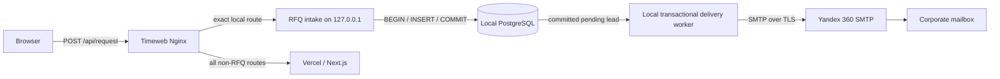

# RFQ RU-first intake v1

Status: target design prepared; not deployed. Base branch: Draft PR #6.

## Target flow



The exact `POST /api/request` Nginx location terminates on the loopback intake
service. Its body does not enter the generic Vercel proxy. The retained Next.js
route is a rollback implementation, not the target Production path. Product
context is resolved from the checksum-validated published-catalog snapshot; no
contact data is sent to Vercel, Supabase, analytics or an external webhook.

## First-write and response contract

1. Nginx accepts at most 100 KB in memory and forwards the unchanged form to
   the loopback service.
2. The service validates consent, required fields, contact format, honeypot,
   rate limit and exact published Product ID/slug.
3. It normalizes source and attribution locations to pathnames and retains only
   `utm_source`, `utm_medium`, `utm_campaign`, `utm_content`, `utm_term` and
   `yclid`.
4. PostgreSQL performs `BEGIN`, `INSERT`, `COMMIT`.
5. Only a successful commit returns `{ "ok": true, "requestId": "<uuid>" }`.
6. The independent worker claims only a committed `pending` or retryable
   `failed` row and sends the locally rendered message via Yandex 360 SMTP.
7. SMTP success marks the row `delivered`. A failure leaves the lead durable as
   `failed`, records only a safe error class and schedules an exponential retry.

An SMTP failure never changes the already accepted browser response. The user
must not resubmit a durable RFQ merely because notification delivery is delayed.

## SMTP transport contract

- Library: `nodemailer@10.0.10`, pinned in the lockfile. It supports Node 20+
  and has no runtime dependencies or telemetry service.
- Host is fail-closed to `smtp.yandex.ru`.
- Preferred mode: port 465 with implicit TLS. Port 587 is supported only with
  STARTTLS (`RFQ_SMTP_SECURE=false` and `requireTLS=true`).
- TLS minimum is 1.2 and SNI uses `smtp.yandex.ru`.
- SMTP authentication, sender, recipient and optional reply-to are manual VPS
  environment values. None belongs in Git, GitHub, Vercel or Preview.
- Nodemailer debug/logger output is disabled. File and URL content loading are
  disabled for every message.
- Header address values are one strict mailbox each and reject CR/LF, display
  names and lists. The subject is derived only from a validated UUID.

Every attempt for a request uses:

```text
Message-ID: <rfq-{requestId}@cyber-medica.ru>
```

The row lease prevents parallel claims and a delivered row cannot be claimed
again. A retry reuses the same Message-ID. Standard SMTP cannot guarantee an
unambiguous outcome after every network failure, so the documented semantics
are **at-least-once with duplicate mitigation**, not exactly-once.

## Locally rendered message

The plain-text and HTML alternatives are generated on the VPS after the commit.
They may contain organization, contact fields, request text, validated Product
context, source pathname, allowlisted attribution, request ID and timestamp.
HTML is escaped. No remote image, pixel, CDN content or attachment is loaded.

System metadata excludes raw IP, User-Agent, full source URLs, query strings and
arbitrary query parameters. Customer-written message text is preserved as the
submitted RFQ content; it is never copied into logs or analytics.

## Exact PII inventory

| Field | Local PostgreSQL | Yandex 360 email after commit | Logs/analytics |
| --- | --- | --- | --- |
| Company | Yes | Yes | No |
| Contact name | Yes | Yes | No |
| Phone | Nullable | If supplied | No |
| Email | Nullable | If supplied | No |
| Message/TZ text | Yes | Yes | No |
| Product context | ID, slug, title, model, manufacturer | Yes | Existing non-PII Product context only |
| Source page | Pathname only | Pathname only | Pathname only |
| Attribution | Six-field allowlist | Same allowlist | Existing R9 allowlist |
| Consent evidence | Version, policy version, text SHA-256, timestamp | Not sent | No |
| Request ID | Yes | Message body and deterministic Message-ID | Yes |
| Raw IP/User-Agent | Never persisted; transient HMAC rate-limit input | No | No |
| Raw body/full URL/query | No metadata copy | No metadata copy | No |

Application logs allow only request ID, status, latency, delivery state,
attempt and a sanitized SMTP error class/code. They never include contact data,
mail body, SMTP envelope, credentials or provider response text. The exact
Nginx location keeps access/error logs disabled.

## Database and queue isolation

- PostgreSQL listens only on loopback; the firewall exposes no public 5432.
- A dedicated login can connect only to `cybermedica_rfq`.
- The application role receives schema `USAGE`, table `SELECT`/`INSERT`, and
  column-scoped delivery-state `UPDATE`; it receives no DDL or `DELETE`.
- `PUBLIC` table access is revoked.
- Claiming uses `FOR UPDATE SKIP LOCKED`, a lease token and attempt limit.
- PostgreSQL is the sole system of record. Email is downstream notification,
  not persistence.

## Retention, backup and deletion boundaries

`RFQ_RETENTION_DAYS` remains unset until the owner/legal team records an
approved retention and destruction term. Encrypted backups may be kept only in
a contractually confirmed Russian location and must follow the same term.

Subject deletion must be dry-run capable and auditable without PII. An
authorized operator resolves exact lead IDs, deletes due primary and backup
copies, and handles the corresponding corporate mailbox copy under the approved
procedure.

## Production evidence gates

- Yandex 360 account/contract evidence for ООО «КИМ» retained.
- Current Yandex 360 DPA evidence retained.
- Timeweb VPS and backup Russian-location evidence retained.
- SMTP credentials created manually only on the VPS.
- Roskomnadzor status remains a separate owner/legal gate.
- TLS connectivity, backup restore and a controlled synthetic RFQ pass before
  any routing change.

## Invariants

- Vercel receives RFQ PII in target design: **NO**.
- Make receives RFQ PII in target design: **NO**.
- Resend receives RFQ PII in target design: **NO**.
- Yandex 360 SMTP is the only email transport: **YES**.
- Russian PostgreSQL commit precedes email: **YES**.
- Primary persistence is local Russian PostgreSQL: **YES**.
- No Production, VPS, Nginx, DNS, Vercel, Supabase or Product-data change is
  made by this branch.

Historical note: an earlier, never-deployed Draft design proposed a post-commit
Make/Resend notification path. This revision replaces that design; the old
transport is not present or selectable in the target runtime.
